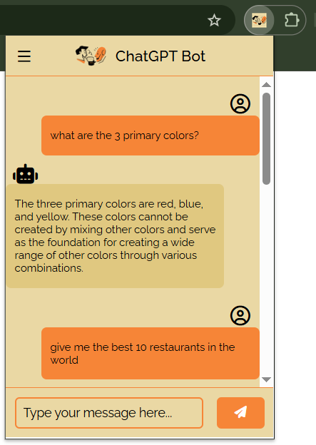
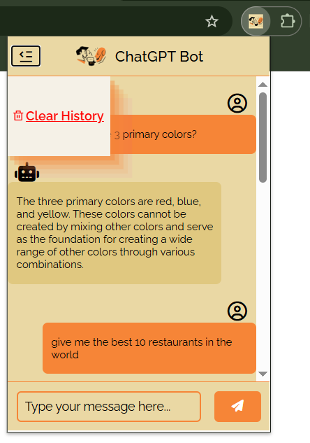

# ChromeExtension-ChatGpt

💬 A Chrome extension that integrates ChatGPT for quick, context-aware AI assistance directly in your browser.

---

## Preview

---

## Features

- **Chat with ChatGPT** using the [RapidAPI ChatGPT-4 endpoint](https://rapidapi.com/).
- **Persistent conversation history** using `chrome.storage.local`.
- **Clear chat history** with a single click.
- **Responsive UI** with user/bot avatars and menu toggle.
- **Keyboard and button support** for sending messages.

---
## How It Works
### 1. `index.html`

- Contains the main UI: header, menu, chat log, input box, and clear history button.
- Loads styles and icons.

### 2. `script.js`

- **Variable Declarations:** Grabs DOM elements for chat, input, buttons, etc.
- **Event Listeners:**  
  - Menu toggle for opening/closing the side menu.
  - Send button and Enter key for sending messages.
  - Clear history button to erase chat and storage.
- **sendMessage Function:**  
  - Handles user input, sends API requests, and displays responses.
  - Special case: typing `developer` shows a custom message.
- **appendMessage Function:**  
  - Renders messages in the chat log with appropriate icons.
  - Saves new messages to `chrome.storage.local` unless loading history.
- **Persistent History:**  
  - On load, retrieves and displays previous conversation from storage.
- **Clear History:**  
  - Clears both the chat log and stored conversation.

### 3. `manifest.json`

- Declares extension metadata and permissions.
- Requires `"storage"` permission for persistent chat history.

### 4. `style.css`

- Styles the chat interface, buttons, avatars, and menu for a clean, modern look.

### 5. `icons/`

- Contains the extension icon(s) used in the header and manifest.

---
